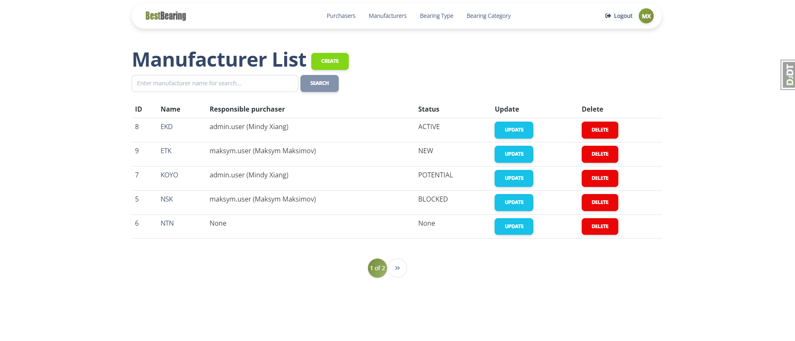

# Company webpage project
> Django project to represent a company and to manage manufacturers (suppliers) and purchasers.

## Check it out!

[Company webpage project deployed in Render](https://company-webpage.onrender.com/)

## Installation

Python3 must be already installed.

```shell
git clone https://github.com/MKeSiMu/company-webpage.git
cd company-webpage
python3 -m venv venv
source venv/bin/activate
pip install -r requirements.txt
python manage.py runserver
```

## Features

* Authentication functionality for Purchaser/User;
* Managing manufacturers, purchasers, bearing category and bearing type directly from website interface;
* Admin panel for advance managing.

## Demo

